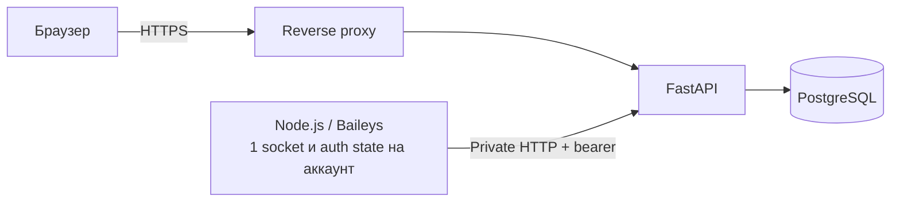

# WhatServ

WhatServ — сервер для одновременного подключения нескольких обычных WhatsApp-аккаунтов, приёма входящих сообщений и выдачи сообщений вместе с текущим Google Authenticator/TOTP-кодом по защищённой индивидуальной ссылке.

В URL присутствует номер аккаунта, как требует текущий сценарий, но номер не является защитой. Ссылка также содержит случайный 256-битный capability-токен, действует ограниченное время и может быть отозвана выпуском новой ссылки.

> [!WARNING]
> Подключение обычных аккаунтов построено на неофициальном WhatsApp Web-клиенте [Baileys](https://github.com/WhiskeySockets/Baileys). Оно не поддерживается WhatsApp и может перестать работать после изменения протокола или привести к ограничению аккаунта. Проект принимает только входящие сообщения: рассылки и автоответы намеренно не реализованы. Для официально поддерживаемой интеграции используйте WhatsApp Business Platform.

## Что уже реализовано

- FastAPI-веб-интерфейс и PostgreSQL для аккаунтов, входящих сообщений и аудита;
- отдельный лёгкий Node.js/Baileys-шлюз: один Multi-Device socket на аккаунт, без Chromium;
- удобная QR-привязка аккаунта в защищённой admin-панели;
- состояния `new`, `pending_qr`, `connecting`, `online`, `degraded`, `logged_out`;
- автоматическая перепривязка с новым QR после logout;
- durable outbox: сообщения переживают временную недоступность FastAPI;
- дедупликация сообщений по WhatsApp ID;
- TOTP по RFC 6238, обратный отсчёт до смены кода;
- раздельное шифрование паролей, TOTP-секретов и короткоживущих QR-данных тремя Fernet-ключами;
- ограниченные по времени, отзываемые публичные ссылки; для проверки хранится HMAC-отпечаток токена, а для повторного показа в админке — отдельно зашифрованная копия;
- `no-store`, CSP, `no-referrer`, CSRF-защита admin-форм и отдельный internal bearer token;
- Alembic-миграции, Docker Compose и автоматические тесты.

## Архитектура



FastAPI — единственный публичный слой. Baileys-шлюз не публикует API наружу и только получает список включённых аккаунтов, отправляет состояния/QR и доставляет входящие сообщения.

## Быстрый запуск

Требования: Docker Engine с Compose v2+, домен и HTTPS reverse proxy для production.

1. Создайте конфигурацию:

   ```powershell
   Copy-Item .env.example .env
   python -c "import secrets; print(secrets.token_urlsafe(32))"
   python -c "from cryptography.fernet import Fernet; print(Fernet.generate_key().decode())"
   ```

2. В `.env` замените все `CHANGE_ME` значения. Для `FERNET_KEY`, `QR_FERNET_KEY` и `CREDENTIAL_FERNET_KEY` сгенерируйте три разных Fernet-ключа. Для `ADMIN_PASSWORD`, `INTERNAL_API_TOKEN` и `ACCESS_TOKEN_PEPPER` используйте разные длинные случайные значения. Пароль PostgreSQL должен совпадать в `POSTGRES_PASSWORD` и `DATABASE_URL`.

3. Укажите внешний адрес в `PUBLIC_BASE_URL`. В production принимается только `https://`. `BACKEND_BIND_ADDRESS` оставьте `127.0.0.1`, если reverse proxy работает на том же сервере. Если Nginx Proxy Manager расположен на другом компьютере в LAN, укажите доступный ему адрес сервера WhatServ, например `192.168.1.66`. Для локальной проверки можно явно поставить:

   ```dotenv
   PUBLIC_BASE_URL=http://127.0.0.1:23864
   ALLOW_INSECURE_HTTP=true
   ```

4. Запустите сервисы:

   ```powershell
   docker compose up --build -d
   docker compose ps
   ```

5. Откройте `http://127.0.0.1:23864/admin` и войдите с `ADMIN_USERNAME` / `ADMIN_PASSWORD`.

## Привязка WhatsApp через QR

1. Сначала укажите email на любом домене и пароль аккаунта. Пароль сразу шифруется отдельным ключом; в карточке его можно показать и скопировать по кнопке.
2. Затем настройте TOTP: можно вставить обычный Base32-секрет или целую ссылку `otpauth://totp/...`, после чего подтвердить секрет текущим шестизначным кодом. TOTP ожидается по умолчанию; для редкого аккаунта без него нужно явно отметить соответствующую галочку.
3. Добавьте телефон WhatsApp в международном формате (`+770...`) и создайте аккаунт.
4. Сохраните показанную индивидуальную ссылку. Позднее её можно снова показать или скопировать на карточке аккаунта; для старых ссылок, созданных до этого обновления, потребуется один перевыпуск.
5. Подождите до 15 секунд и обновите admin-страницу. На карточке появится QR.
6. На телефоне откройте WhatsApp → **Связанные устройства** → **Привязка устройства** и отсканируйте QR.
7. Статус изменится на `online`, QR автоматически исчезнет. При истечении QR шлюз выдаст свежий; после выхода связанного устройства будет запрошена новая привязка.

TOTP-секрет проверяется перед сохранением и хранится только в зашифрованном виде. В админке виден лишь статус `TOTP настроен` / `без TOTP`; исходный секрет никогда не показывается повторно. При необходимости TOTP можно безопасно добавить, заменить или удалить на карточке аккаунта.

QR доступен только admin-пользователю, хранится в БД зашифрованным и имеет короткий TTL (`QR_TTL_SECONDS`, по умолчанию 120 секунд).

## Индивидуальная страница

Созданная ссылка имеет вид:

```text
https://example.com/inbox/77001234567/<случайный-секрет>
```

Страница показывает email, пароль по отдельной кнопке (автоматически скрывается через 30 секунд), состояние WhatsApp, последние входящие сообщения и текущий TOTP-код с кнопкой копирования и обратным отсчётом. Она обновляется каждые три секунды. По умолчанию ссылка действует 720 часов; срок задаётся `CAPABILITY_TTL_HOURS`. Кнопка **Новая ссылка** немедленно отзывает старую.

Для каждого сообщения выводятся доступные WhatsApp-имя, полный номер, JID, тип, идентификатор и локальные дата/время. Нажатие на текст или TOTP копирует значение. Кнопка **Написать в WhatsApp** открывает чат с отправителем через `wa.me`. В админке компактно показываются текущий TOTP и последнее сообщение; поля **У кого** и **Комментарий** остаются только в защищённой админке.

> [!CAUTION]
> Индивидуальная ссылка даёт доступ к паролю, TOTP и входящим сообщениям. Обращайтесь с ней как с мастер-паролем: не отправляйте в чаты и немедленно выпускайте новую при подозрении на утечку.

## Перепривязка ошибочного WhatsApp

На карточке аккаунта есть действие **Разлогинить и перепривязать WhatsApp**. Оно требует браузерного подтверждения и ручного ввода полного номера телефона. Команда сохраняется в БД, worker вызывает настоящий WhatsApp logout, удаляет только auth-каталог выбранного аккаунта и после подтверждения готовит свежий QR. Сообщения, email, пароль и TOTP при этом сохраняются.

## Проверки разработчика

```powershell
python -m venv .venv
.\.venv\Scripts\python.exe -m pip install -r backend\requirements.txt
Push-Location backend
..\.venv\Scripts\python.exe -m pytest -q
Pop-Location

Push-Location whatsapp-worker
npm.cmd ci
npm.cmd test
Pop-Location

docker compose --env-file .env.example config --quiet
```

Python-тесты используют SQLite только как изолированную тестовую БД. Production-контейнер перед стартом выполняет `alembic upgrade head` для PostgreSQL.

## Локальный менеджер Dockhand

В `tools/dockhand-manager` находится отдельная localhost-only веб-панель для управления Dockhand Git repositories и Git stacks через официальный API. Она диагностирует конфликты имён до создания, требует отдельный preflight, блокирует повторную отправку, не сохраняет API-токен и маскирует секретные поля ответов Dockhand.

На сервере с Dockhand:

```bash
python3 tools/dockhand-manager/server.py \
  --dockhand-url http://127.0.0.1:9853
```

С рабочей машины открыть SSH-туннель:

```bash
ssh -L 8765:127.0.0.1:8765 user@ASUSdebian
```

Затем открыть `http://127.0.0.1:8765`. Подробная инструкция и модель безопасности: [Dockhand Git Stack Manager](tools/dockhand-manager/README.md).

Compose явно ссылается на runtime-переменные через `${VAR}`, поэтому значения из Dockhand **Stack variables / Overrides** попадут в контейнеры. Обязательные секреты перечислены в `.env.example`; сам `.env` в Git добавлять не нужно и нельзя.

## Production checklist

- Завершайте TLS на reverse proxy, включите HSTS и rate limits для `/admin`, `/inbox` и `/api/public`.
- Не открывайте host-порт `23864` во внешнюю сеть. По умолчанию Compose привязывает его к `127.0.0.1`; при удалённом LAN-прокси ограничьте доступ к `BACKEND_BIND_ADDRESS:23864` его IP через firewall.
- Ограничьте `/admin` VPN/IP allowlist и используйте уникальный длинный пароль.
- Храните `.env` в secret manager, не в Git. Не меняйте Fernet-ключи без процедуры re-encryption.
- Разместите `postgres-data` и `whatsapp-sessions` на шифрованном диске; файлы Baileys являются полноценными credentials связанного устройства.
- Настройте резервные копии PostgreSQL и сессионного volume, доступ к ним — по принципу минимальных привилегий.
- Обеспечьте синхронизацию времени хоста (NTP), иначе TOTP будет неверным.
- Настройте срок хранения сообщений согласно требованиям к персональным данным.
- Следите за обновлениями и security advisories [Baileys](https://github.com/WhiskeySockets/Baileys/security).

Один worker рассчитан на десятки аккаунтов, но запускать две его реплики на одном наборе аккаунтов нельзя: обе откроют одинаковые linked-device сессии. Для multi-host/HA следующая ступень — распределённая аренда аккаунтов (leases) и зашифрованное SQL/KMS-хранилище Signal keys вместо `useMultiFileAuthState`.

## Подготовка первого push

Репозиторий уже содержит `.gitignore`, `.gitattributes`, EditorConfig и CI. После назначения remote:

```powershell
git remote add origin <URL-репозитория>
git push -u origin main
```

## Правовые ограничения

Используйте только аккаунты, владельцы которых явно разрешили подключение. Не используйте проект для спама, массовых сообщений, обхода ограничений или несанкционированного доступа. Ознакомьтесь с [WhatsApp Terms of Service](https://www.whatsapp.com/legal/terms-of-service) и предупреждениями проекта Baileys.
