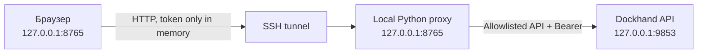

# Dockhand Git Stack Manager

Локальная одностраничная панель для предсказуемого управления Git repositories и Git stacks в Dockhand через REST API.

Инструмент решает несколько неудобных сценариев Dockhand:

- показывает Git stacks отдельно для каждого environment;
- сравнивает Git remote и branch до регистрации repository;
- обнаруживает конфликт с Git Stack и обычным Compose stack;
- повторно использует уже зарегистрированный repository;
- отправляет создание Git Stack строго один раз;
- предоставляет отдельные Test, Sync, Deploy и Delete actions;
- показывает очищенный JSON-ответ вместо общей ошибки UI;
- удаляет из ответов `webhookSecret`, tokens, passwords, private/TLS keys и cookies.

## Архитектура



Python proxy нужен из-за browser CORS и для централизованных ограничений безопасности. Он не является универсальным HTTP proxy.

## Требования

- Python 3.11+;
- Dockhand `1.0.25+` с API token authentication;
- SSH-доступ к серверу, если Dockhand находится на удалённой машине;
- современный браузер.

Внешние Python- или JavaScript-зависимости не требуются.

## Быстрый запуск на ASUSdebian

В SSH-сессии на сервере:

```bash
cd ~/GROM/Whatserv
python3 tools/dockhand-manager/server.py \
  --dockhand-url http://127.0.0.1:9853
```

Процесс выведет:

```text
Dockhand Manager: http://127.0.0.1:8765
Dockhand target:  http://127.0.0.1:9853
Listening on localhost only. Press Ctrl+C to stop.
```

На рабочей машине открыть отдельный терминал:

```bash
ssh -L 8765:127.0.0.1:8765 user@ASUSdebian
```

Открыть в браузере:

```text
http://127.0.0.1:8765
```

В Dockhand создать временный token через **Profile → API tokens → Generate token**, вставить его в панель и нажать **Подключить**. Значение должно начинаться с `dh_`.

## Другой адрес Dockhand

URL Dockhand задаётся только аргументом доверенного локального процесса:

```bash
python3 tools/dockhand-manager/server.py \
  --dockhand-url https://dockhand.example.com \
  --port 8765 \
  --timeout 900
```

URL нельзя изменить из браузера. Допускается только `http://` или `https://` origin без credentials, query, fragment и path prefix.

## Рабочий процесс

1. Подключиться временным Dockhand API token.
2. Выбрать environment.
3. Ввести Git URL, repository name, branch, stack name и compose path.
4. Нажать **Проверить** и убедиться, что preflight не нашёл конфликтов.
5. Нажать **Создать и развернуть** и подтвердить точное имя стека.
6. После создания использовать отдельные действия Sync или Deploy.
7. По завершении нажать **Отключить** и отозвать временный token в Dockhand.

Если repository с тем же нормализованным remote и branch уже существует, панель использует его ID. Если имя repository связано с другим remote/branch, создание блокируется.

### Переменные WhatServ в Dockhand

Перед первым успешным запуском добавьте значения из `.env.example` в **Stack variables / Overrides** Dockhand. Обязательны `POSTGRES_PASSWORD`, `DATABASE_URL`, `ADMIN_PASSWORD`, `INTERNAL_API_TOKEN`, `ACCESS_TOKEN_PEPPER`, `FERNET_KEY`, `QR_FERNET_KEY` и `PUBLIC_BASE_URL`. `INTERNAL_API_TOKEN` должен быть одинаковым для backend и worker, а пароль PostgreSQL — совпадать в `POSTGRES_PASSWORD` и `DATABASE_URL`.

Compose использует явные `${VAR}`-ссылки: именно так Dockhand передаёт overrides в контейнеры. Файл `.env` не коммитьте и не указывайте в поле **Additional env file**, если его физически нет в клонируемом repository.

Точная API-схема сохранения variables/secrets для Git Stack в Dockhand 1.0.37 не опубликована. Панель не отправляет догадки вроде `envVars`. Если первый create завершился ошибкой отсутствующей переменной, сначала нажмите **Обновить данные**: если stack уже появился, не создавайте его повторно. Откройте этот stack в Dockhand, заполните **Variables / Overrides**, затем вернитесь в панель и нажмите **Deploy**.

## Границы безопасности

- сервер слушает только `127.0.0.1`; опции `0.0.0.0` нет;
- API token хранится только в памяти JavaScript и очищается при disconnect/reload;
- token не попадает в URL, cookies, Local Storage или Session Storage;
- proxy не пишет access logs;
- разрешены только необходимые Dockhand Git/Stack endpoints и HTTP methods;
- произвольный upstream URL нельзя передать из браузера;
- mutation requests требуют same-origin и CSRF token;
- проверяется локальный `Host`, что снижает риск DNS rebinding;
- включены CSP, `no-store`, `no-referrer`, `nosniff` и запрет embedding;
- секретные ключи рекурсивно маскируются до отправки ответа браузеру;
- Delete требует вручную ввести точное имя repository или stack;
- repository не удаляется автоматически вместе с Git Stack.

Не публиковать порт `8765` в LAN/интернет. Для удалённого доступа использовать только SSH-туннель.

## Тесты

```bash
python3 -m unittest discover -s tools/dockhand-manager/tests -v
node --check tools/dockhand-manager/app.js
```

Тесты проверяют allowlist, query validation, redaction, Host protection, token requirement, CSRF/Origin, security headers и ровно один upstream mutation request.

## Ограничения

- API DTO Dockhand могут меняться между версиями; неизвестная форма списка считается ошибкой и показывается в панели, чтобы не принять пустой ответ за отсутствие стеков.
- Self-signed TLS certificates намеренно не поддерживают bypass verification. Добавить CA в системное trust store.
- Инструмент не читает и не показывает содержимое `.env`.
- Создание credentials для приватного Git repository пока выполняется в Dockhand.
- Это диагностический локальный инструмент, а не публичная admin-панель.
